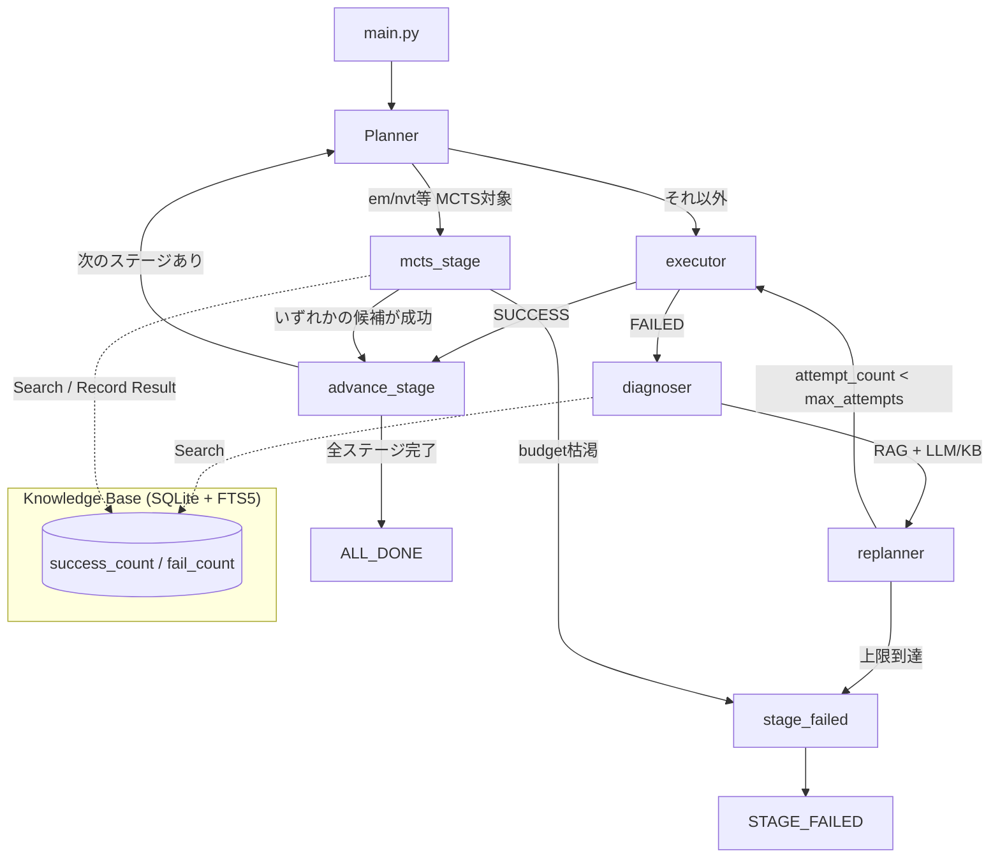

# GromacsMaster

GROMACSによる分子動力学(MD)シミュレーションを自律的に実行・回復するAIエージェント。

**Plan → Execute → Diagnose → Replan** のループをLangGraphの状態遷移グラフで実装し、
`em`/`nvt`のような「切りの良い単位」ではモンテカルロ木探索(MCTS)で複数のパラメータ候補を
並行的に検討しながら、失敗しても自律的にパラメータを調整して実行し続けます。

arXiv:[2512.19799](https://arxiv.org/abs/2512.19799) (PhysMaster) のアーキテクチャ思想
(自律的な推論と計算の統合、検証済み手法の知識蓄積) を、GROMACSによるMDシミュレーションという
ドメインに落とし込んだ実装です。

---

## 🌟 特徴

### 1. em/nvt単位のモンテカルロ木探索 (MCTS)
GROMACSの1回の実行は数分〜数時間かかるため、単純な「1つの修正を試して失敗したら次」という
逐次リトライは非効率です。`em`・`nvt`のような**「切りの良い単位」**でMCTSを導入し、複数の
パラメータ候補を木構造で管理しながら、UCB1アルゴリズムで有望な候補から優先的に実行します。

- **ノード** = あるステージにおける1つのパラメータ候補
- **選択(Selection)** = KnowledgeBaseの過去の成功率を事前分布(prior)としたUCB1
- **プレイアウト** = 実際のgrompp/mdrun実行 (コストが高いため、これが唯一の「本物の試行」)
- **打ち切り条件** = いずれかの候補が成功した時点でそのステージは完了とみなし、次のステージへ

MCTS対象ステージは `mcts_stages` (デフォルト: `["em", "nvt"]`) で変更できます。対象外の
ステージ (`pdb2gmx`, `editconf`, `solvate`, `genion`, `npt`, `md`) は、単発実行 +
Diagnoser/Replannerによる1本道リトライ (`max_attempts`回) で処理されます。

### 2. ハイブリッド型ナレッジベース (SQLite + FTS5)
計算化学でよく知られたエラーパターン (LINCS WARNINGやエネルギー発散など) をあらかじめ
シードしつつ、実行のたびに成功/失敗を `success_count` / `fail_count` として記録し、
MCTSのUCB1における事前分布として活用します。実行すればするほど、その環境・その系に
特化した修正候補が優先されるようになります。

### 3. 完全な再現性 (reproduce.sh)
実行した全てのgmxコマンドと、動的に生成した`.mdp`ファイルの中身を、work_dir内の
`reproduce.sh` 1本に記録します。**中間ファイルが全て消えても、このスクリプトと最初の
入力PDBファイルさえあれば、エージェントを介さずシェルだけで全く同じ手順を再現できます。**
対話的な入力が必要なコマンド (`genion`等) は `echo 'SOL' | gmx genion ...` の形で
記録されるため、入力内容ごと再現可能です。

### 4. ステージ別の自由なパラメータ上書き
`current_config["stage_overrides"]` に辞書を書くことで、ステージごとに好きなパラメータを
上書きできます。例えば「`nvt`→`npt`(Berendsen)の緩和計算はそのままに、本番run (`md`) だけ
Parrinello-Rahmanバロスタットに切り替える」といった使い方が可能です。

```python
current_config = {
    "dt": 0.002, "nsteps": 50000,
    "tcoupl": "V-rescale", "ref_t": 300,
    "pcoupl": "Berendsen",  # 全ステージ共通のデフォルト (npt平衡化はこのまま)
    "stage_overrides": {
        "md": {"pcoupl": "Parrinello-Rahman", "nsteps": 500000},
    },
}
```

> **注意**: `em`/`nvt`はMCTS探索の対象です。この2ステージに`stage_overrides`で
> `dt`等を固定指定すると、MCTSが選んだ値より`stage_overrides`が優先されてしまい、
> 探索結果を意図せず上書きしてしまいます。`em`/`nvt`には使わず、`npt`/`md`側で
> 使うことを推奨します。

---

## 🏗️ アーキテクチャ



ワークフローは `pdb2gmx → editconf → solvate → genion → em → nvt → npt → md` の
8ステージ固定です (`nodes/planner.py`)。

---

## 📦 インストール

```bash
git clone https://github.com/nakamura26002002921-a11y/gromacs-master.git
cd gromacs-master
pip install -e .
```

**必須の外部依存: GROMACS本体 (`gmx`コマンド)**
このエージェントはPython側で全ての計算を行うわけではなく、実際に`gmx`コマンドを
subprocessで呼び出します。事前にGROMACSをインストールし、`gmx`にPATHが通っている
環境で実行してください。

```bash
gmx --version   # 実行できることを確認
```

LLMによる診断 (`diagnoser.py`) を使う場合は `OPENAI_API_KEY` または
`ANTHROPIC_API_KEY` を環境変数に設定してください。**未設定でも動作します**
(KnowledgeBaseの検索結果のみでフォールバック診断します)。

---

## 🚀 使い方

### 基本
```bash
python main.py                     # デフォルト (1ALC) をRCSBからダウンロードして実行
python main.py --pdb-id 1AKI       # 別のPDB IDを指定
python main.py --pdb-file my.pdb   # ローカルのPDBファイルを使う (ダウンロードしない)
python main.py --work-dir ./run1   # 作業ディレクトリを固定 (省略時は一時ディレクトリ)
```

### 力場・水モデル
```bash
python main.py --force-field charmm36-jul2022 --water tip4p
```
`-ff`に渡す文字列は、手元のGROMACS環境にインストール済みの力場ディレクトリ名と
一致している必要があります。利用可能な力場は次のコマンドで確認できます。
```bash
echo | gmx pdb2gmx -f any.pdb -o /dev/null
```

### 温度・圧力制御
```bash
# 全ステージ共通のデフォルトを変更
python main.py --tcoupl Nose-Hoover --ref-t 310 --pcoupl Parrinello-Rahman --ref-p 1.0 --tau-p 2.0

# ステージ別に自由に上書き (nvt→npt(Berendsen)はそのまま、mdだけ変更)
python main.py --stage-override '{"md": {"pcoupl": "Parrinello-Rahman", "nsteps": 500000}}'
```

### 実行結果の確認
```
✅ Final Status: ALL_DONE | STAGE_FAILED
🔧 Final Config: {...}
📜 History steps recorded: N          # MCTSステージの探索履歴の件数
📄 Reproduction script: <work_dir>/reproduce.sh
```

`STAGE_FAILED`の場合は`work_dir`内の`.log`/`reproduce.sh`と、返された`last_error`を
確認してください。

---

## ⚙️ `current_config` 一覧

| キー | 既定値 | 用途 |
|---|---|---|
| `force_field` | `amber99sb-ildn` | `pdb2gmx -ff` |
| `water` | `tip3p` | `pdb2gmx -water` |
| `dt` | `0.002` | 積分タイムステップ [ps] |
| `nsteps` | `50000` | 各ステージのステップ数 |
| `emtol` | `1000.0` | `em`の収束判定 [kJ/mol/nm] |
| `tcoupl` | `V-rescale` | 温度制御アルゴリズム (nvt/npt/md) |
| `ref_t` | `300` | 目標温度 [K] |
| `tau_t` | `0.1` | 温度の緩和時定数 [ps] |
| `pcoupl` | `Berendsen` | 気圧制御アルゴリズム (npt/md) |
| `pcoupltype` | `isotropic` | 圧力制御のタイプ |
| `ref_p` | `1.0` | 目標圧力 [bar] |
| `tau_p` | `2.0` | 圧力の緩和時定数 [ps] |
| `compressibility` | `4.5e-5` | 等温圧縮率 [bar⁻¹] |
| `stage_overrides` | `{}` | ステージ別の上書き設定 (上記いずれのキーも指定可) |

---

## 📂 ディレクトリ構成

```text
gromacs-master/
├── main.py                        # エントリポイント (CLI引数・PDBダウンロード)
├── configs/default_config.yaml    # (現状未使用のプレースホルダー)
├── src/gromacs_agent/
│   ├── core/
│   │   ├── graph.py                # LangGraphの状態遷移定義 (本体)
│   │   ├── state.py                # AgentState (TypedDict)
│   │   └── config.py               # Pydanticモデル (現状mainからは未参照)
│   ├── nodes/
│   │   ├── planner.py              # ワークフロー計画・work_dir初期化
│   │   ├── executor.py             # gmxコマンド実行 (MCTS対象外ステージ)
│   │   ├── mcts_stage.py           # em/nvtのMCTS探索ノード
│   │   ├── diagnoser.py            # エラー診断 (LLM or KBフォールバック)
│   │   └── replanner.py            # 診断結果をconfigへ反映し再試行キューへ
│   ├── mcts/
│   │   ├── node.py                 # MCTSNode (UCB1, backpropagation)
│   │   ├── search.py               # MCTSStageSearch (探索エンジン本体)
│   │   └── candidates.py           # KB/ヒューリスティックによる候補生成
│   ├── knowledge/db.py             # SQLite + FTS5 ナレッジベース
│   ├── tools/gromacs_tools.py      # gmxコマンド実行ラッパー (stdin/reproduce.sh対応)
│   └── utils/
│       ├── command_logger.py       # reproduce.sh書き出し
│       └── logger.py               # structlog設定
└── tests/                          # pytest (test_agent.py / test_mcts.py / test_diagnoser.py)
```

---

## 🧪 テスト

```bash
python -m pytest -q
```

`subprocess.run`をモックしているため、GROMACS本体が無い環境でもエージェントの
制御フロー (MCTSのルーティング、リトライ、ステージ進行) を検証できます。

---

## 既知の制約

- `configs/default_config.yaml` と `core/config.py` のPydanticモデルは、現状
  `main.py`からは参照されていません (設定は`main.py`内のPythonコードで直接組み立てています)。
  YAMLベースの設定読み込みに統一したい場合は要拡張です。
- `pdb2gmx`は、欠損原子や複数チェーンなど構造上の問題があると対話的なプロンプトを出す
  ことがあります。現状`run_gmx_command`は既定で標準入力をEOF終端するため、その場合は
  素直に失敗として扱われ、diagnoser/replannerのリトライに回ります (自動修復はしません)。
- MCTSはステージ単位 (例: `em`全体) を1回のプレイアウトとして扱うため、ステージ内の
  途中経過 (checkpoint) からの再開はサポートしていません。
