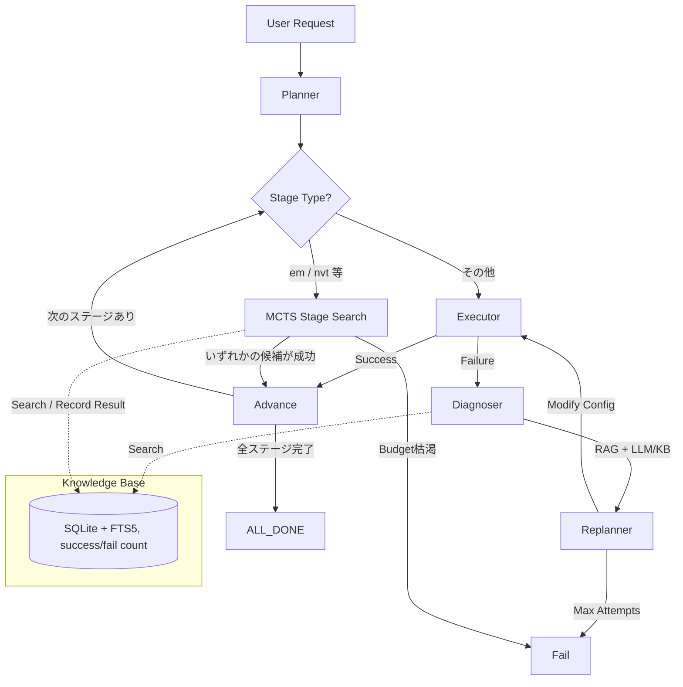

# 🧬 GromacsMaster: Autonomous AI Agent for MD Simulations

**GromacsMaster** は、計算化学研究のための自律型AIエージェントです。
GROMACSを用いた分子動力学（MD）シミュレーションにおいて、準備から解析までを自律的に実行し、エラー発生時には自ら診断・修正・再試行を行う「人間のような研究者」をサポートします。

本プロジェクトは、AI物理学者エージェント「PhysMaster」の設計思想をGROMACSのドメインに最適化して実装しています。

---

## 🚀 概要 (Overview)

MDシミュレーションは、系設定、エネルギー最小化、平衡化、本計算と続く複雑なパイプラインと、LINCS警告や座標の吹き飛び（Blowing up）といった多様なエラーに直面します。
GromacsMasterは、単なるラッパースクリプトではありません。

*   **Plan**: 系から必要なワークフローを計画
*   **Execute**: GROMACSコマンドを安全に実行
*   **Observe**: ログとエネルギーを監視
*   **Diagnose**: エラーの原因をRAGとLLMで推定
*   **Replan**: パラメータ（dt, 制約条件など）を修正
*   **Reflect**: 経験をKnowledge Baseに蓄積

このサイクルを自律的に回すことで、研究者のトライ＆エラーの負荷を大幅に低減します。

---

## ✨ 主な特徴 (Key Features)

### 1. LangGraphによる堅牢なワークフロー管理
単純なReActループではなく、状態遷移グラフ（LangGraph）を採用。
「成功→次ステップ」「失敗→診断→修正→再試行」という分岐をコードレベルで保証しつつ、柔軟なエラーハンドリングを実現します。

### 2. 計算化学ドメイン特化RAG
SQLite + FTS5を用いた軽量かつ高速なRAG（Retrieval-Augmented Generation）を実装。
過去のエラーログと解決策を蓄積し、未知のエラー遭遇時にも類似ケースからヒントを得て推論します。

### 3. 自律的パラメータチューニング
エラー内容（例: `LINCS WARNING`）に基づき、LLMが自律的に以下のような修正を提案・実行します。
*   `dt` (タイムステップ) の縮小
*   `emtol` (EM収束閾値) の厳格化
*   Position Restraintの追加
*   水モデルの変更提案

### 4. 完全なログとトレーサビリティ
すべてのLLM推論、実行コマンド、修正履歴をJSON形式で記録。
「なぜこのパラメータに変更したのか」の根拠を後から追跡可能です。

### 5. EM/NVT単位のモンテカルロ木探索 (MCTS)
GROMACSの1回の実行は数分〜数時間かかるため、単純な「1つの修正を試して失敗したら次」という
逐次リトライでは非効率です。GromacsMasterは `em` や `nvt` のような**「切りの良い単位」**でMCTSを
導入し、複数のパラメータ候補を木構造で管理しながら、UCB1アルゴリズムで有望な候補から優先的に
実行します。

*   **ノード** = あるステージにおける1つのパラメータ候補
*   **選択(Selection)** = KnowledgeBaseのsuccess_rateを事前分布(prior)としたUCB1
*   **プレイアウト** = 実際のgrompp/mdrun実行 (コストが高いため、ここが唯一の「本物の試行」)
*   **打ち切り条件** = いずれかの候補が成功した時点でそのステージは完了とみなし、次のステージへ

これにより、探索コスト(実行回数)を抑えつつ、単一の仮説に固執しない頑健な自動修正が可能になります。
MCTS対象ステージは `configs/default_config.yaml` の `mcts.stages` で変更できます
(デフォルト: `["em", "nvt"]`)。MCTS対象外のステージ (`pdb2gmx`, `editconf` など) は、
従来通りシンプルな単発実行 + Diagnoser/Replannerの1本道リトライで処理されます。

---

## 🏗️ アーキテクチャ



---

## 🛠️ インストール

### 前提条件
*   Python 3.12+
*   GROMACS (環境変数 `PATH` に `gmx` が通っていること)
*   OpenAI API Key または Anthropic API Key

### セットアップ

リポジトリのクローンと依存パッケージのインストール（`uv` 推奨）:

```bash
git clone https://github.com/nakamura26002002921-a11y/gromacs-master.git
cd gromacs-master

# uvを使った環境構築
uv venv
source .venv/bin/activate
uv pip install -e .
```

### 環境変数の設定

`.env` ファイルを作成し、APIキーを設定してください。

```env
OPENAI_API_KEY=sk-...
# または
ANTHROPIC_API_KEY=sk-ant-...
```

---

## 📖 使い方 (Usage)

### 1. 設定ファイルの準備
`configs/default_config.yaml` を編集し、シミュレーション条件を設定します。

```yaml
agent:
  max_attempts: 3
  llm_provider: "openai"   # openai or anthropic (未設定ならKnowledgeBaseのみで診断)
  model_name: "gpt-4o"

mcts:
  stages: ["em", "nvt"]        # MCTSで探索するステージ
  max_iterations: 4            # 1ステージあたりの最大実行回数
  max_candidates: 3            # 1回の展開で生成する候補数
  exploration_constant: 1.41   # UCB1の探索定数 (sqrt(2))
  max_depth: 3                 # 連鎖的な修正探索の最大深さ

gromacs:
  force_field: "amber99sb-ildn"
  water_model: "tip3p"
```

### 2. 実行
対象のPDBファイルを配置し、エージェントを起動します。

```bash
python main.py
```

### 3. 結果の確認
実行ごとの探索木・修正履歴は `AgentState.history` にJSON形式で蓄積され、
標準出力にも最終ステータスとConfigが表示されます。

---

## 📂 ディレクトリ構成

```text
gromacs-master/
├── configs/
│   └── default_config.yaml   # agent / mcts / gromacs設定
├── src/gromacs_agent/
│   ├── core/                 # State, Graph定義 (LangGraph), Pydantic Config
│   ├── nodes/                # planner / executor / diagnoser / replanner / mcts_stage
│   ├── mcts/                 # MCTSNode, MCTSStageSearch, 候補生成ロジック
│   ├── knowledge/            # SQLite + FTS5 ナレッジベース (success/fail count付き)
│   ├── tools/                # GROMACSコマンド実行ラッパー
│   └── utils/                # ロガー設定 等
├── tests/                    # pytestテスト (agent全体 / MCTSエンジン単体)
└── main.py                   # エントリポイント
```

---

## 🧪 開発・テスト

GROMACSがインストールされていない環境でもテストが実行できるよう、`subprocess` をモックしたテストを用意しています。

```bash
# テストの実行
pytest tests/

# カバレッジ計測
pytest --cov=gromacs_agent tests/
```

---

## ⚠️ 免責事項 (Disclaimer)

*   **計算結果の責任**: 本エージェントが生成したパラメータや修正内容によって生じたシミュレーションの失敗、計算資源の消費、科学的結論の誤りについて、開発者は一切の責任を負いかねます。必ず研究者自身で結果を検証してください。
*   **LLMの限界**: LLMは物理法則を完全に理解しているわけではありません。特に複雑な系や特殊な力場においては、誤った診断を行う可能性があります。
*   **セキュリティ**: `subprocess` を使用してコマンドを実行するため、信頼できない入力を与えないでください。

---

## 🤝 コントリビューション

計算化学ドメインの知識追加（Knowledge Baseの拡充）や、新しいGROMACS機能のサポートを歓迎します。
Pull Requestをお送りください。

---

## 📜 ライセンス

MIT License
